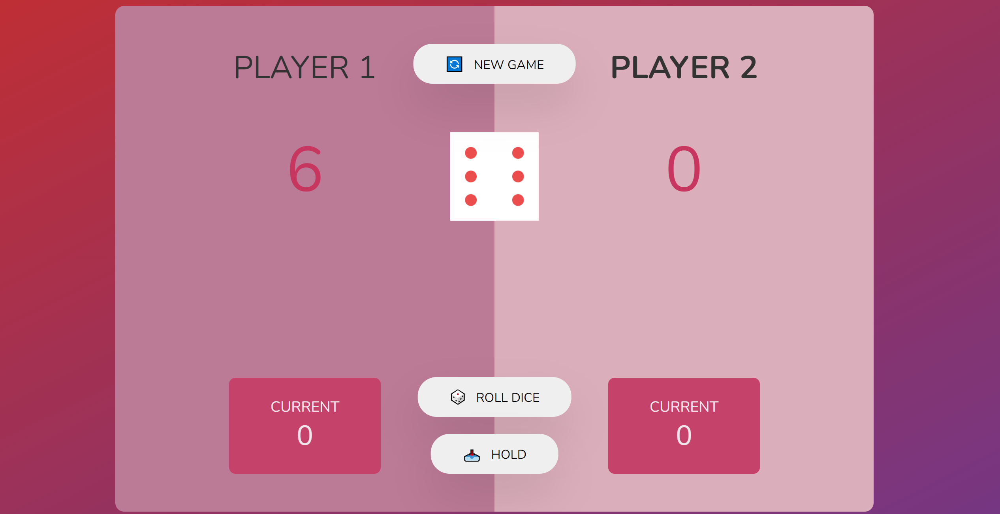

# Pick Game

## Table of contents

- [Overview](#overview)
  - [Screenshot](#screenshot)
  - [Links](#links)
- [My process](#my-process)
  - [Built with](#built-with)
  - [What I learned](#what-i-learned)
  - [Continued development](#continued-development)
- [Author](#author)

## Overview

### Screenshot



This is project's simple view...

### Links
- Live Site URL: [Live site]( https://morcicek.github.io/Pick-Game/)

## My process

### Built with

- Semantic HTML5 markup
- CSS custom properties
- Flexbox
- JavaScript

### What I learned

I learned Js Events and DOM with this project.Also I reinforced my knowledge about CSS and HTML and practiced for flexbox, positions..

To see how you can add code snippets, see below:

```html
<h3 class="current-label">Current</h3>
<p class="current-score" id="current--0">0</p>
```

```css
.player {
  height: 40rem;
  width: 50%;
  background-color: #bb7a96;
  display: flex;
  flex-flow: column;
  justify-content: space-between;
  align-items: center;
}
}
```

```js
newRoll.addEventListener("click", () => {
  if (playing) {
    const diceNum = Math.trunc(Math.random() * 6) + 1;
    dice.src = `dice-${diceNum}.png`;
    dice.classList.remove("hidden");
    if (diceNum != 1) {
      currentScore += diceNum;
      document.getElementById(`current--${activePlayer}`).textContent =
        currentScore;
    } else {
      document.getElementById(`current--${activePlayer}`).textContent = 0;
      activePlayer = activePlayer == 0 ? 1 : 0;
      currentScore = 0;
      player0El.classList.toggle("player--active");
      player1El.classList.toggle("player--active");
    }
  }
});
};
```

### Continued development

I still work on Web Development and want to build more project with JavaScript.

## Author

- Lınkedin - [Mehmet Cevat Morcicek](https://www.linkedin.com/in/mehmet-cevat-morcicek-b50a29178/)
- Twitter - [@morcicek_m](https://twitter.com/home?lang=en)
